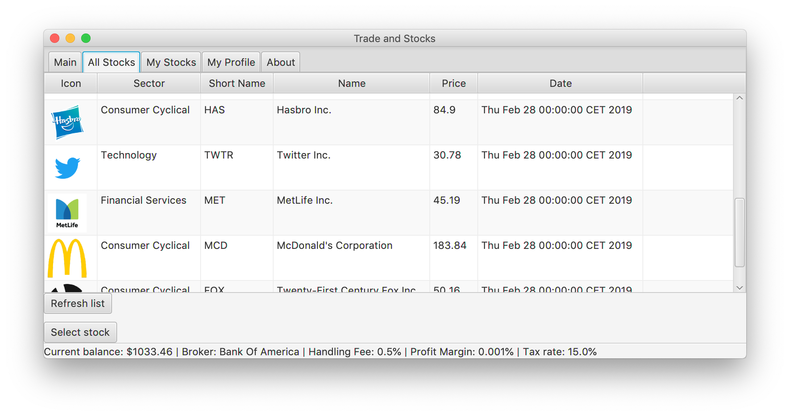
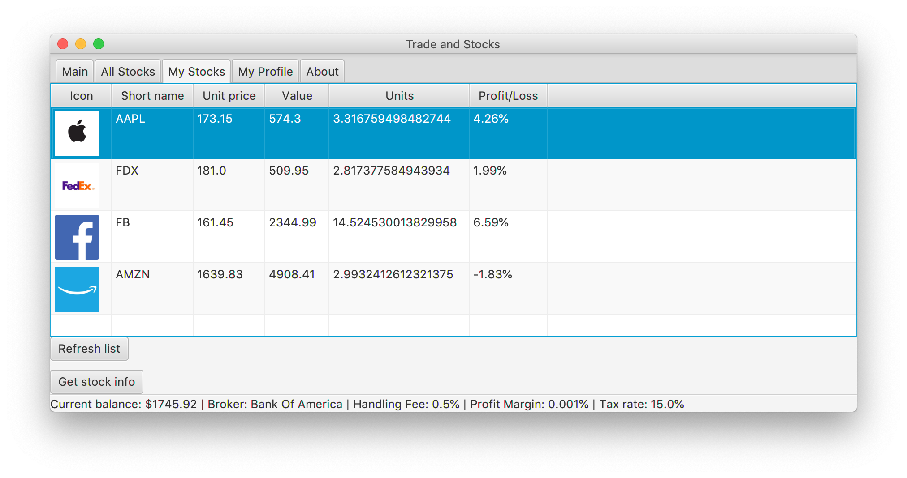
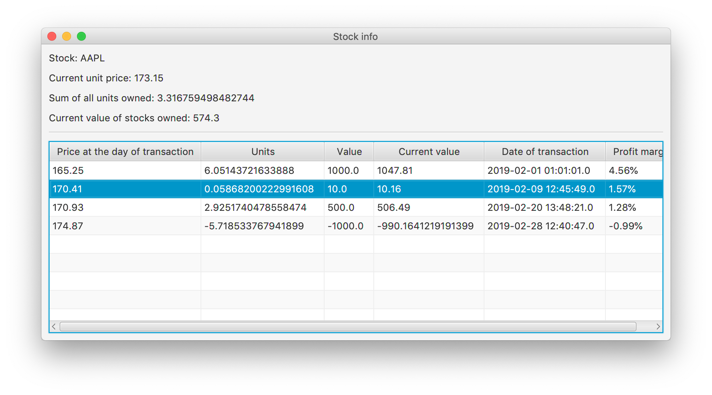
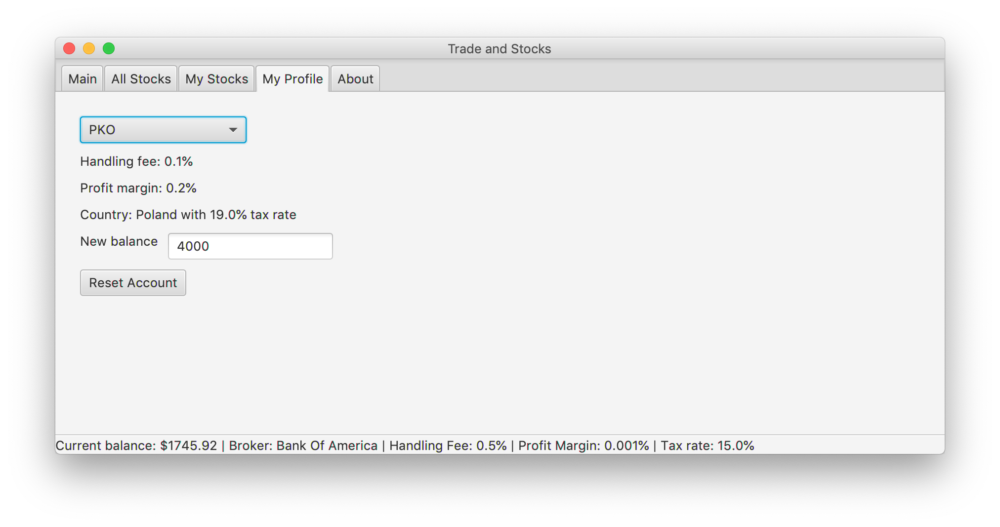
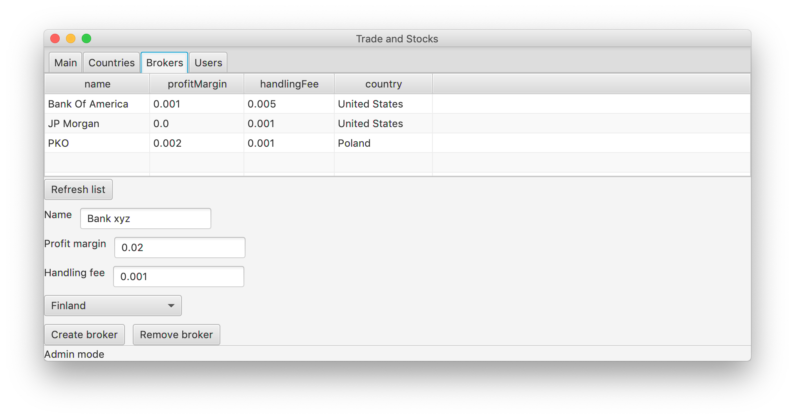

# Projekt-Zespolowy-PPN
Trade and Stocks contains:

- desktop client app (Spring Boot, JavaFX)
- web app (Python, Django)

Main features of the desktop app:
- Simulation of sell/buy transactions using real market price data (from iextrading API).
- Calculating tax rate, profit margin and handling fee based on selected broker and country.
- Showing profit/loss on specific stock.
- Admin panel (includes creating/removing countries, brokers, users from database)

## Web application
https://trades-and-stocks.herokuapp.com/

## Screenshots

