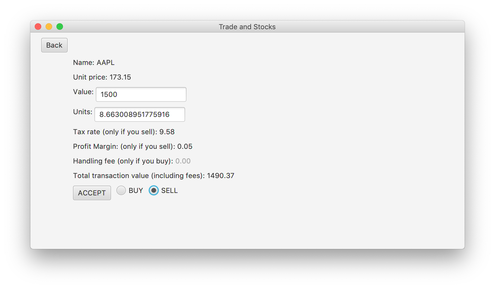

# Projekt-Zespolowy-PPN
Trade and Stocks contains:

- desktop client app (Spring Boot, JavaFX) - by Jacek Papis
- web app (Python, Django) - by Michał Piątek

Main features of the desktop app:
- Simulation of sell/buy transactions using real market price data (from iextrading API).
- Calculating tax rate, profit margin and handling fee based on selected broker and country.
- Showing profit/loss on specific stock.
- Admin panel (includes creating/removing countries, brokers, users from database)

Main features of the web app:
- Using iextrading API to get real market data.
- Providing information about companies listed on stock exchange.
- Calculating single and portfolio rates of return.
- Estimating future stock prices using linear regression.
- Performing Monte Carlo Simulation of future stock prices.

## Web application
https://trades-and-stocks.herokuapp.com/

## Screenshots (Desktop app)

